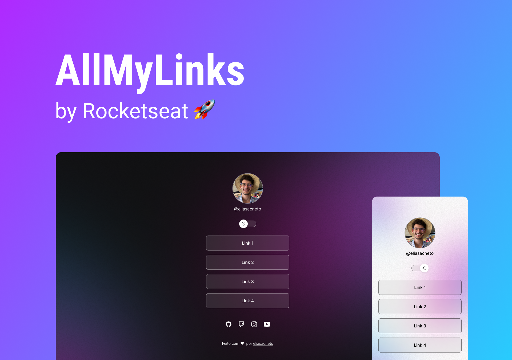

<h1 align="center"> All My Links Page 🔗 </h1>

 

  

## ⚡️ Techs

This project was developed using this following techs:

- HTML & CSS
- JavaScript
- Git & Github
- Figma

## 💻 About the project

All My Links page is a link aggregator to use as an online business card.

## 🔖 Layout

You can view the project's layout from [this link](https://www.figma.com/community/file/1187422022288947321). To access is neccessary to have an account on [Figma](https://figma.com).

---

This project was developed following the instructions from Rocketseat  :rocket: [Rocketseat community on Discord](https://discord.gg/rocketseat)
